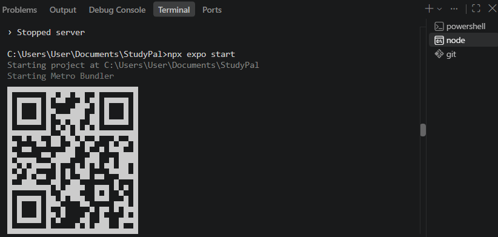

# StudyPal
A student study planner app

# Target Domain
Education & Productivity

# Introduction
The creation of this app is inspired by my real life need to have a centralised organisation system for my university studies.

# Specific Problem Statement
Uni students like me have multiple units, assignments and tasks to keep track of. A centralised system is required. This app has been developed to help properly organise it all, and for students to monitor their study progress for each unit.

# Solution & App Features
StudyPal is a simple study-planning mobile application where students can organise work into units, create major tasks for those units, and further create subtasks for each major task. When tasks are completed, they can tick it off, and the progress bar would reflect it. 

This app allows users to:
    ✓ See units
    ✓ Add new units
    ✓ View major tasks when clicked on unit 
    ✓ Create new major task
    ✓ Add subtasks for each major task
    ✓ See number of subtasks for each unit
    ✓ Mark subtasks as completed
    ✓ Track progress for each unit
    ✓ Toggle theme between light and dark mode.

Overall App Features
    ✓ multi-screen navigation
    ✓ unit management
    ✓ major task management
    ✓ subtask management
    ✓ progress tracking
    ✓ light and dark theme toggle
    ✓ flatList-based data display
    ✓ dynamic state changes using React hooks

# Main Screens
1. Home Screen
    Displays the student's units and their current progress. Users can also access Settings and add new units.

    
    

2. Unit Details Screen
    Displays the major tasks and subtasks associated with a selected unit. Users can add tasks and subtasks and mark subtasks as completed.

    
    
    

3. Add Unit Screen 
    Allows users to create a new study unit by entering the unit name, unit code, and target completion date.

    
    

4. Settings Screen
    The Settings screen allows users to switch between Light Mode and Dark Mode. The theme is applied throughout the application.

    
    

# Setup Instructions
Since this is a React Native prototype:
* Prerequisities
    Have the following installed:
        ✓ Node.js
        ✓ Visual Studio Code
        ✓ Expo
        ✓ Git

* Installation
    1. Clone the repository: 
        git bash: 
        git clone https://github.com/devmini-jay/StudyPal.git

    2. Open project folder:
        cmd:    
            cd StudyPal

    3. Install project dependencies:
        cmd:
            npm install

    4. Start the Expo development server:
        cmd:
            npx expo start

        

    5. Run the app using Android emulator, iOS simulator or the Expo Go application
        Scan qr code through the Expo Go.
